# Chart 生成完整状态图

> 生成日期：2026-04-13
> 覆盖版本：Phase 1-17（当前已实现）
> 涉及文件：`superset/ai/graph/nodes_parent.py`、`nodes_child.py`、`builder.py`、`runner.py`

---

## 一、整体架构

Chart 生成由**父图（Parent Graph）+ 子图（Child Subgraph）**两层组成：

- **父图**：数据集发现 → Schema 读取 → 图表规划（产出 `chart_intents` 列表）
- **子图**：每个 `ChartIntent` 独立执行一次 SQL 生成 → 执行 → 图表创建
- **包装器节点**：同步调用子图，实时转发 Redis 事件，将结果累加回父图

```
父图: parse_request → search_dataset → select_dataset → read_schema → plan_dashboard
                                           ↓
                              [循环] single_chart_subgraph（调用子图）
                                           ↓
                        chart模式: __end__    dashboard模式: create_dashboard
```

---

## 二、完整状态图

```mermaid
flowchart TD
    START([START]) --> parse_request

    %% ── 父图节点 ──────────────────────────────────────────
    parse_request["**P1 parse_request** ｜ LLM
    ─────────────────────────────
    输入: request 原始请求
    处理: 提取结构化意图
    输出:
      target_table: 表关键词
      analysis_intent: trend/comparison/...
      preferred_viz: 图表类型偏好
      chart_count: 期望图表数量
      user_language: zh/en
    ─────────────────────────────
    Phase 11: 注入 conversation_history"]

    parse_request -->|解析成功| search_dataset
    parse_request -->|LLM 格式错误| PERR(["__end__ ❌\nllm_format_error"])

    search_dataset["**P2 search_dataset** ｜ Code
    ─────────────────────────────
    输入: goal.target_table
    工具: SearchDatasetsTool
    Phase 12 四级模糊搜索:
      L1: 精确匹配（直接返回完整元数据）
      L2: description/verbose_name 包含
      L3: 表名substring匹配
      L4: difflib 相似度 ≥ 0.4
    返回:
      status=found → dataset_candidates=[完整metadata]
      status=not_found → dataset_candidates=[候选名列表]"]

    search_dataset -->|有候选| select_dataset
    search_dataset -->|JSON解析失败| SERR(["__end__ ❌\ntool_error"])
    search_dataset -->|空数据库| SERR2(["__end__ ❌\nno_dataset"])

    select_dataset["**P3 select_dataset** ｜ Code
    ─────────────────────────────
    输入: dataset_candidates
    逻辑:
      1个候选 → 直接选
      多候选 → 评分: 精确=100 前缀=50 包含=20 其他=0
      score>0 → auto-select 最高分
      score=0 → 触发澄清（Phase 17）
    候选只有 table_name → re-search"]

    select_dataset -->|有 datasource_id| read_schema
    select_dataset -->|仅 table_name 需补全| search_dataset
    select_dataset -->|score=0 多候选| clarify_user
    select_dataset -->|无候选| clarify_user

    clarify_user["**P3b clarify_user** ｜ Code (Phase 17)
    ─────────────────────────────
    发送 text_chunk 事件:
      - 候选数据集编号列表
      - 引导用户回复
    正常结束（非错误）"]

    clarify_user --> CLARIFY(["__end__ ⏸\n等待用户下一轮回复"])

    read_schema["**P4 read_schema** ｜ Code
    ─────────────────────────────
    输入: selected_dataset (含完整列元数据)
    处理:
      datetime_cols: is_dttm=True 的列
      dimension_cols: groupable 且字符串类型
      metric_cols: 数值类型列
      saved_metrics: 已保存指标名列表
      saved_metric_expressions: 指标名→SQL映射
    Phase 12 新增:
      column_descriptions: {col: description}
      column_verbose_names: {col: verbose_name}
    Phase 13（待实现）:
      business_metrics: {name: {sql, description}}"]

    read_schema --> plan_dashboard

    plan_dashboard["**P5 plan_dashboard** ｜ LLM
    ─────────────────────────────
    输入: goal + schema_summary
    输出: chart_intents 列表（N 个意图）
    每个意图包含:
      chart_index: 序号
      analysis_intent: trend/comparison/...
      slice_name: 图表标题
      sql_hint: 可选 SQL 提示
      preferred_viz: 图表类型（可 null）
    chart mode: chart_count 强制=1"]

    plan_dashboard -->|有意图| single_chart_subgraph

    %% ── 子图循环 ──────────────────────────────────────────
    subgraph SUBGRAPH ["│  子图：SingleChartState（每个 ChartIntent 执行一次）  │"]
        direction TB

        plan_query["**C1 plan_query** ｜ LLM
        ─────────────────────────
        输入: chart_intent + schema_summary
        Phase 12 注入: column_descriptions_block
        Phase 13 注入: business_metrics_block（待实现）
        LLM 错误重试: 读取 last_error.node 修正
        输出: sql_plan =
          metric_expr: 聚合表达式
          dimensions: [分组列]
          time_field: 时间列/null
          time_grain: month/day/year/null
          order_by: 排序/null
          limit: ≤500"]

        plan_query -->|ok| validate_sql

        validate_sql["**C2 validate_sql** ｜ Code
        ─────────────────────────
        Step1: _normalize_sql_plan
          · metric_expr 是列名 → 加 SUM()
          · metric_expr 是指标名 → 展开 SQL
          · dimensions 过滤不在 schema 的列
          · time_field 不合法 → null
          · order_by 列不存在 → null
          · gender维度+性别指标 → SUM(num)
        Step2: _compile_sql → 生成 SELECT SQL
        Step3: _validate_sql_static
          · 禁止 DDL/DML
          · 必须有 LIMIT"]

        validate_sql -->|ok + sql_valid=True| execute_query
        validate_sql -->|失败 sql_attempts<3| plan_query

        execute_query["**C3 execute_query** ｜ Code
        ─────────────────────────
        工具: ExecuteSqlTool
        RetryPolicy: 最多2次
          (TimeoutError/ConnectionError/OSError)
        最多返回 100 行
        SQL 报错 → recoverable=True 重试"]

        execute_query -->|ok| analyze_result
        execute_query -->|SQL错误 sql_attempts<3| plan_query
        execute_query -->|sql_attempts≥3| CEND_ERR(["__end__(子图) ❌\nsql_execution_error"])

        analyze_result["**C4 analyze_result** ｜ Code
        ─────────────────────────
        解析文本表格 → 列分析
        输出 ResultSummary:
          row_count / has_datetime / datetime_col
          numeric_cols / string_cols
          low_cardinality_cols (distinct<20)
          datetime_cardinality
          suitability_flags:
            good_for_trend: datetime + numeric + dt_card>3
            good_for_composition: low_card + numeric
            good_for_kpi: row_count=1 且 1个numeric
            good_for_distribution: row>10, 1个numeric
            good_for_comparison: low_card + numeric
            good_for_table: 始终 True
        Phase 11: LLM 生成 insight（best-effort）"]

        analyze_result --> select_chart

        select_chart["**C5 select_chart** ｜ LLM
        ─────────────────────────
        输入:
          · analysis_intent + preferred_viz
          · suitability_flags
          · chart_registry（所有可用类型）
        若 preferred_viz 已设定 → 强制覆盖 LLM 选择
        输出: ChartPlan =
          viz_type / slice_name / semantic_params / rationale"]

        select_chart -->|ok| normalize_chart_params
        select_chart -->|LLM 解析失败| CEND_ERR

        normalize_chart_params["**C6 normalize_chart_params** ｜ Code
        ─────────────────────────
        compile_superset_form_data():
          · 将 ChartPlan.semantic_params 转为
            Superset API form_data 格式
          · 绑定 datasource_id / viz_type
          · 解析 x_axis / metrics / groupby
          · 设置 time_range / row_limit"]

        normalize_chart_params -->|ok| create_chart
        normalize_chart_params -->|ValueError repair_attempts<3| repair_chart_params

        repair_chart_params["**C7 repair_chart_params** ｜ LLM
        ─────────────────────────
        输入: last_error + chart_plan + schema
        LLM 修复 chart_plan JSON
        发送 retrying 事件到 Redis"]

        repair_chart_params -->|ok| normalize_chart_params
        repair_chart_params -->|LLM 解析失败| CEND_ERR

        create_chart["**C8 create_chart** ｜ Code
        ─────────────────────────
        RetryPolicy: 最多2次（通用错误）
        幂等校验:
          10分钟内 同名+同viz+同datasource
          → 直接复用已有图表
        CreateChartTool → Superset Chart API
        输出: created_chart =
          chart_id / slice_name / viz_type
          explore_url / message"]

        create_chart -->|ok| CEND_OK(["__end__(子图) ✅\ncreated_chart"])
        create_chart -->|API失败 repairs<2| repair_chart_params
        create_chart -->|repairs≥2| CEND_ERR
    end

    single_chart_subgraph["**包装器节点**
    _make_subgraph_wrapper
    ─────────────────────────
    同步调用子图 stream()
    实时转发子图各节点事件到 Redis
    将 created_chart 累加到 created_charts[]
    current_chart_index++"]

    single_chart_subgraph -->|chart模式 所有图完成| DONE_CHART(["__end__ ✅\nchart_created 事件\ndone 事件"])
    single_chart_subgraph -->|dashboard模式 还有图| after_subgraph

    after_subgraph["after_subgraph
    ───────────────
    current_chart_index++
    判断是否还有 chart_intents"]

    after_subgraph -->|还有图| single_chart_subgraph
    after_subgraph -->|全部完成| create_dashboard

    create_dashboard["**P6 create_dashboard** ｜ Code
    ─────────────────────────────
    幂等校验: 30分钟内同 request_id → 复用
    布局所有 created_charts
    CreateDashboardTool → Superset Dashboard API
    输出: dashboard_id / dashboard_title / url"]

    create_dashboard --> DONE_DASH(["__end__ ✅\ndashboard_created 事件\ndone 事件"])
```



---

## 三、重试计数器说明

两个独立计数器，互不干扰：

| 计数器 | 控制范围 | 上限 | 上限行为 |
|--------|---------|------|---------|
| `sql_attempts` | `plan_query → validate_sql → execute_query` 循环 | 3 | `recoverable=False` → `__end__` |
| `repair_attempts` | `normalize_chart_params → repair_chart_params` 循环 | 3 | `max_repairs` → `__end__` |

---

## 四、LLM 调用节点汇总

| 节点 | 调用类型 | 输入 token 量级 | 失败处理 |
|------|---------|----------------|---------|
| P1 `parse_request` | `llm_call_json` | ~500 chars | `__end__` |
| P5 `plan_dashboard` | `llm_call_json_list` | ~800 chars | `__end__` |
| C1 `plan_query` | `llm_call_json` | ~1000 chars (含列描述) | 重试最多3次 |
| C5 `select_chart` | `llm_call_json` | ~600 chars | `__end__` |
| C7 `repair_chart_params` | `llm_call_json` | ~500 chars | `__end__` |
| C4 `analyze_result`(insight) | `_get_llm_response` | ~300 chars | 忽略失败（best-effort）|

---

## 五、事件流（前端接收顺序）

```
intent_routed      ← Phase 16 意图路由结果
thinking           ← 每个父图节点完成时
  "请求解析完成"
  "数据集搜索完成"
  "数据集已确定"
  "Schema 读取完成"
  "图表规划完成"
  "SQL 计划生成完成"
  "SQL 校验通过"
  "查询执行完成"
  "数据分析完成"
  "图表类型已选定"
  "参数编译完成"
retrying           ← validate_sql / execute_query / normalize_chart_params 失败重试时
  {node, reason, attempt}
sql_generated      ← validate_sql 成功时
  {sql}
data_analyzed      ← analyze_result 完成时
  {row_count, suitability}
error_fixed        ← repair_chart_params 执行时
  {message}
chart_created      ← create_chart 成功时
  {chart_id, slice_name, viz_type, explore_url}
dashboard_created  ← create_dashboard 成功时（仅 dashboard 模式）
  {dashboard_id, dashboard_title, url}
clarify            ← Phase 17 澄清时（无图表创建）★ 见下注
done               ← 整个图执行结束
  {summary}
error              ← 不可恢复错误
  {message, type}
```

> **★ 注**：`clarify_user` 节点当前实现使用 `text_chunk` 事件（已知 Bug #3），
> 设计意图为 `clarify` 事件（含结构化 options 数据）。

---

## 六、状态字段流向

```
DashboardState (父图)
├── request ──────────────────────────→ parse_request
├── goal ←────────────────────────────── parse_request
│   ├── target_table ─────────────────→ search_dataset
│   ├── analysis_intent ──────────────→ plan_dashboard, select_chart
│   ├── preferred_viz ────────────────→ plan_dashboard, select_chart (强制覆盖)
│   └── chart_count ──────────────────→ plan_dashboard
├── dataset_candidates ←──────────────── search_dataset
├── selected_dataset ←────────────────── select_dataset
├── schema_summary ←──────────────────── read_schema
│   ├── datasource_id, table_name
│   ├── datetime_cols, dimension_cols, metric_cols
│   ├── saved_metrics, saved_metric_expressions
│   └── column_descriptions, column_verbose_names (Phase 12)
├── chart_intents[] ←─────────────────── plan_dashboard
├── current_chart_index ←─────────────── after_subgraph
└── created_charts[] ←────────────────── 子图累加 (operator.add)

SingleChartState (子图)
├── chart_intent ─────────────────────→ plan_query, select_chart
├── schema_summary ───────────────────→ plan_query, validate_sql, normalize_chart_params
├── sql_plan ←────────────────────────── plan_query
├── sql ←─────────────────────────────── validate_sql
├── query_result_raw ←────────────────── execute_query
├── query_result_summary ←────────────── analyze_result
├── chart_plan ←──────────────────────── select_chart / repair_chart_params
├── chart_form_data ←─────────────────── normalize_chart_params
└── created_chart ←───────────────────── create_chart
```

---

## 七、已知问题与 Bug

| # | 严重度 | 位置 | 描述 |
|---|--------|------|------|
| 1 | 🔴 高 | `context.py:add_message` | 误删 `router_meta` 条目 |
| 2 | 🔴 高 | `base.py:run()` | `router_meta` 传给 LLM API 报错 |
| 3 | 🟡 中 | `nodes_parent.py:clarify_user` | 用 `text_chunk` 而非 `clarify` 结构化事件 |
| 4 | 🟡 中 | `nodes_parent.py:read_schema` | `raw["datasource_id"]` 无防护（KeyError 风险）|
| 5 | 🟡 中 | `tasks.py` + `runner.py` | StateGraph 路径不写 `tool_summary`，多轮上下文失效 |
| 6 | 🟢 低 | `nodes_child.py:183` | 注释语义误导（代码逻辑正确）|

---

## 八、Phase 对照表

| Phase | 涉及节点 | 功能 |
|-------|---------|------|
| Phase 8 | 全部 | StateGraph 基础架构 |
| Phase 11 | `parse_request`(history注入), `analyze_result`(insight) | 多轮对话上下文 |
| Phase 12 | `search_dataset`(模糊搜索), `read_schema`(列描述), `plan_query`(描述注入) | 数据集发现与列语义 |
| Phase 13 | `read_schema`(business_metrics), `plan_query`(指标块) | 业务指标语义层（待实现）|
| Phase 17 | `select_dataset`(评分路由), `clarify_user`(新节点) | 澄清机制 |
