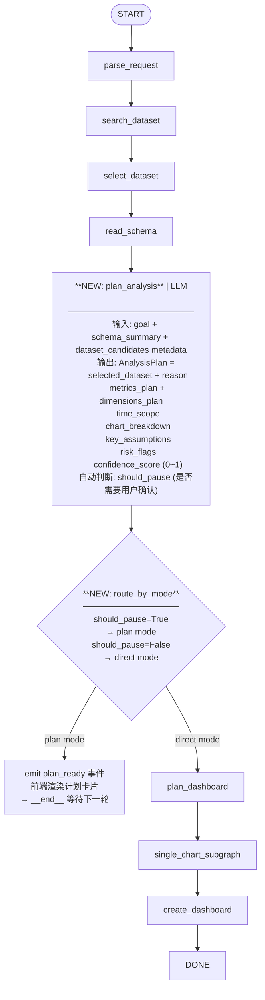

# Phase 19: Agent BI 自适应增强方案 (Dynamic Layout & Plan Mode)

基于对当前图表生成架构的深度分析，本阶段聚焦两大核心升级方向：
1. **动态排版引擎**（Dynamic Layout Engine）：解决仪表板布局刻板问题
2. **显式计划确认层**（Plan Mode）：在执行前暴露系统关键假设，提供用户语义纠偏能力

---

## 一、动态排版引擎优化 (Dynamic Layout Engine)

### 1.1 痛点回顾

目前 `export.py → append_charts` 一律强制 `width = 4`，每 3 张图打包一行，完全忽略不同图表类型的信息密度差异（KPI 指标卡只需 2 格，多维交叉大表需要整行 12 格）。

### 1.2 已识别的设计缺陷（相比初版草案）

**缺陷 1：width 决策时机错误**
初版草案提出在 `plan_dashboard`（父节点，此时 viz_type 未定）就指定图表尺寸，但 `viz_type` 是到子图 `select_chart` 才最终确定的。如果 plan 选 medium，实际 select 出来的是宽表，就会错配。

**正确修正**：Width 决策应下移至两处：
- **静态方案**：在 `catalog.py` 的 `ChartTypeDescriptor` 中为每种图注册 `default_width`，代码层静态决策。
- **动态方案**：由 `select_chart` 子节点在输出 `ChartPlan` 时，一并输出 `suggested_width`（1-12 的整数）。

**缺陷 2：Flex-grow 弹性封口不可行**
Superset 的 `position_json` 是静态 JSON，`width` 是固定整数，前端按整数渲染，无 CSS flex 机制。

**正确修正**：行填满时不做弹性伸缩，改为"**尾部补全策略**"：若一行剩余宽度 > 0 且无更多图表可填，则将最后一张图的 width 扩张至补满整行。

### 1.3 修正后的装箱算法

```python
def append_charts_v2(
    position: dict[str, Any],
    charts_with_widths: list[tuple[Slice, int]],  # (Slice, width)
) -> dict[str, Any]:
    """Flow-layout bin-packing: 每行按 width 填充，不超 12 列。"""
    has_grid = "ROOT_ID" in position and "GRID_ID" in position["ROOT_ID"]["children"]
    rows: list[list[tuple[str, int]]] = []  # 每行: [(chart_hash, width)]
    current_row: list[tuple[str, int]] = []
    current_used = 0

    for slice_obj, width in charts_with_widths:
        chart_hash = f"CHART-{suffix()}"
        position[chart_hash] = {
            "children": [], "id": chart_hash,
            "meta": {
                "chartId": slice_obj.id, "height": DEFAULT_CHART_HEIGHT,
                "sliceName": slice_obj.slice_name, "uuid": str(slice_obj.uuid),
                "width": width,
            },
            "type": "CHART",
        }
        if current_used + width > 12:
            # 尾部补全：将最后一张图扩展至行末
            if current_row:
                last_hash, last_w = current_row[-1]
                new_w = last_w + (12 - current_used)
                position[last_hash]["meta"]["width"] = new_w
                current_row[-1] = (last_hash, new_w)
            rows.append(current_row)
            current_row = [(chart_hash, width)]
            current_used = width
        else:
            current_row.append((chart_hash, width))
            current_used += width
    if current_row:
        rows.append(current_row)

    if has_grid:
        for row_items in rows:
            row_hash = f"ROW-N-{suffix()}"
            position["GRID_ID"]["children"].append(row_hash)
            chunk_hashes = [h for h, _ in row_items]
            position[row_hash] = {
                "children": chunk_hashes, "id": row_hash,
                "meta": {"0": "ROOT_ID", "background": "BACKGROUND_TRANSPARENT"},
                "type": "ROW", "parents": ["ROOT_ID", "GRID_ID"],
            }
            for chart_hash, _ in row_items:
                position[chart_hash]["parents"] = ["ROOT_ID", "GRID_ID", row_hash]
    return position
```

### 1.4 catalog.py 补全 default_width

在 `ChartTypeDescriptor` 的 schema 中新增字段：

| viz_type | default_width | 说明 |
|:---|:---:|:---|
| `big_number` / `big_number_total` | 3 | KPI 指标卡，小巧精干 |
| `pie` | 4 | 环形/扇形图，中等宽度 |
| `echarts_timeseries_line` | 6 | 折线图，需要横向空间看趋势 |
| `echarts_timeseries_bar` | 6 | 柱状图，需要宽度展示分类 |
| `table` | 12 | 明细宽表，占满整行 |
| 其他 | 4 | 默认 |

---

## 二、长尾参数逃生舱架构 (Advanced Params Escape Hatch)

### 2.1 已识别的设计缺陷（相比初版草案）

**缺陷 3：黑名单防御边界错误**
初版草案采用"排除黑名单"（不让 LLM 覆盖 `metric/groupby/datasource`），但 Superset form_data 里还有间接影响 SQL 生成的危险字段，如 `adhoc_filters`（可注入任意 WHERE）、`having_filters`、`time_range`（恶意覆盖导致全表扫）。黑名单策略防御面不足。

**正确修正**：改为**白名单放行**，只允许纯视觉类参数通过逃生舱：

```python
SAFE_VISUAL_PARAMS: frozenset[str] = frozenset({
    "donut",              # pie 环形化
    "show_legend",        # 图例显示
    "row_limit",          # 显示条数限制（纯视觉）
    "color_scheme",       # 主题配色
    "label_colors",       # 序列颜色覆盖
    "y_axis_bounds",      # Y 轴范围固定
    "zoomable",           # 折线图可缩放
    "opacity",            # 面积图透明度
    "stack",              # 堆叠模式
    "only_total",         # 仅显示合计标签
    "show_value",         # 显示数值标签
})
```

**缺陷 4：LLM 幻觉字段名**
初版草案的 `donut=true`、`barchart_stack=true` 均不是 Superset 实际字段名（真实字段为 `innerRadius` 数值、`stack` 布尔）。大模型极可能记错字段名，造成"写入了但不生效"的静默 Bug。

**正确修正**：将高级参数字段的合法取值，直接内嵌写入 `catalog.py` 的 `advanced_params_schema`，在 Prompt 生成时由注册表动态注入给 LLM，而非让 LLM 自由发挥：

```python
# catalog.py 新增字段示例
"pie": ChartTypeDescriptor(
    ...,
    advanced_params_schema={
        "innerRadius": {"type": "number", "range": [0.1, 0.8], "default": 0,
                        "description": "环形图内圆半径比（0=实心饼图）"},
        "show_legend": {"type": "boolean", "default": True},
    }
)
```

---

## 三、显式计划确认层 (Plan Mode) ⭐ 本阶段核心新增

### 3.1 核心问题定义

当前系统最大的风险不是"执行不出来"，而是**"在错误的语义上执行得很顺"**。尤其是：
- 数据集选择偏差（选错表但评分最高）
- 指标口径理解错误（SUM vs COUNT，收入 vs 应收）
- 时间粒度假设错误（按月 vs 按天）
- Dashboard 图表拆解偏差（10 张图中 7 张在回答同一个问题）

这些错误在当前的全自动执行路径下**不报错、不警告、直接建图**，用户只有打开仪表板才能发现，代价高昂。

### 3.2 Plan Mode 的本质：显式化系统假设

Plan Mode 不是"再多一个 LLM 规划节点"，而是：
> **在真正查数和建图之前，把系统对业务问题的关键假设，结构化地展示出来，让用户一眼识别偏差**。

Plan Mode 的输出必须是结构化内容，不是泛泛文字描述。至少包含：

| 字段 | 示例内容 |
|:---|:---|
| **selected_dataset** | `birth_names`（置信度 92%）|
| **selection_reason** | 表名精确匹配，包含 gender/state/num 等目标列 |
| **metrics_plan** | `SUM(num)`(出生总数), `SUM(num_boys)/SUM(num)`(男性占比) |
| **dimensions_plan** | `state`(州), `gender`(性别), `ds`(年份, 按年粒度) |
| **time_scope** | 全量历史数据，时间列 `ds`，粒度：年 |
| **chart_breakdown** | 10 张图：趋势(2) | 对比(3) | KPI(2) | 表格(2) | 占比(1) |
| **key_assumptions** | ⚠️ 假设 `num` 代表每行的出生人数统计值 |
| **risk_flags** | 🟡 `num_boys`/`num_girls` 可能在某些年份为空，比例计算需 NULLIF |

### 3.3 状态图插入位置

最合理的插入点：**`read_schema` 完成之后，`single_chart_subgraph` 开始之前**。

原因：
- 太前（在 `read_schema` 之前）：系统连列信息都没读，计划会太空洞
- 太后（在 `plan_dashboard` 之后）：LLM 已经把 10 张图细化拆解了，计划已经很沉重
- **最佳位置**：schema 在手后，先输出一份轻量计划摘要，再决定是等待用户确认还是直接进入细化执行

**新状态流转路径：**

```
parse_request → search_dataset → select_dataset → read_schema
                                                        ↓
                                                  plan_analysis  ← 新增节点
                                                        ↓
                                                  route_by_mode  ← 新增路由
                                                   /           \
                                             plan mode        direct mode
                                                ↓                  ↓
                                         output plan          plan_dashboard
                                         → __end__             → single_chart_subgraph
                                         (等待用户确认)              → create_dashboard
```

### 3.4 两种运行模式设计

#### Direct Mode（高置信度直接执行）
- 系统判断语义明确、无歧义、低风险
- 跳过确认，在 `plan_analysis` 节点内部 **触发 `thinking` 事件对用户展示计划摘要（非阻塞）**，随即继续执行
- 用户偶有机会看到系统的理解，但无须动作

#### Plan Mode（低置信度、高风险、需要确认）
- 系统判断存在歧义或语义风险
- `plan_analysis` 输出结构化计划后触发 `plan_ready` 事件（前端渲染为可交互的计划卡片）
- 流程中断，等待用户回复 "确认执行" 或 "修正：..." 后，下一轮对话继续调度

### 3.5 Plan Mode 自动触发场景

Plan Mode **不应只是用户手动开的开关**，而是系统的自动降级策略。以下场景应自动触发：

| 触发条件 | 触发逻辑来源 | 优先级 |
|:---|:---|:---:|
| 数据集候选多于 1 个且分差 < 20 | `select_dataset` 打分结果 | 🔴 高 |
| 用户要求 Dashboard（多图）| `goal.agent_mode == "dashboard"` | 🟡 中 |
| 问题涉及多个业务主题混合（收入+客户+工单）| `plan_analysis` LLM 判断 | 🟡 中 |
| 涉及派生指标/比例指标/同比环比 | `plan_analysis` LLM 判断 | 🟡 中 |
| `parse_request` 结构化置信度 < 阈值 | goal 字段缺失率超限 | 🔴 高 |
| 返回的数据集内没有包含用户提到的列名 | `read_schema` 匹配检测 | 🔴 高 |
| 预计 SQL 涉及超大表（行数 > 1000 万配置阈值）| DB metadata 检测 | 🟢 低 |

### 3.6 Plan Mode 设计原则：轻计划、强约束

> ❌ **不要做**：每次都生成很长的审批文档，让用户一条条逐行确认
> ✅ **应该做**：输出一份 3-5 秒能读完的结构化摘要，让用户一眼识别是否理解对了

示例计划摘要输出（前端渲染为卡片形式）：

```
📊 分析计划摘要（请确认后继续）

数据集: birth_names（美国出生姓名统计）
核心指标: 出生总人数(SUM num)、男性占比(SUM num_boys / SUM num)
分析维度: 州(state)、性别(gender)、年份(ds / 按年粒度)
时间范围: 全量历史数据
预计图表: 10张（趋势2 | 对比3 | KPI2 | 表格2 | 占比1）
⚠️ 关键假设: num_boys/num_girls 可能存在空值，比例计算已做 NULLIF 保护

[✅ 确认执行]  [✏️ 修正后重试]
```

---

## 四、Phase 19 完整状态图（含新节点）



---

## 五、实施路线

| 阶段 | 任务 | 优先级 | 工作量 |
|:---|:---|:---:|:---:|
| 19-A | `catalog.py` 新增 `default_width` + `advanced_params_schema` | 🟡 中 | 小 |
| 19-B | `append_charts` 重构为流式装箱算法（接受 width 参数）| 🟡 中 | 小 |
| 19-C | `state.py` 新增 `AnalysisPlan` TypedDict | 🔴 高 | 小 |
| 19-D | `nodes_parent.py` 新增 `plan_analysis` 节点 | 🔴 高 | 中 |
| 19-E | `nodes_parent.py` 新增 `route_by_mode` 路由节点 | 🔴 高 | 小 |
| 19-F | `builder.py` 新增 `plan_analysis` 和 `route_by_mode` 到图边 | 🔴 高 | 小 |
| 19-G | `events.py` 新增 `plan_ready` 事件类型 | 🔴 高 | 极小 |
| 19-H | `normalizer.py` 白名单参数透传（逃生舱） | 🟢 低 | 小 |
| 19-I | 前端 Plan Card 渲染组件 | 🔴 高 | 大 |
